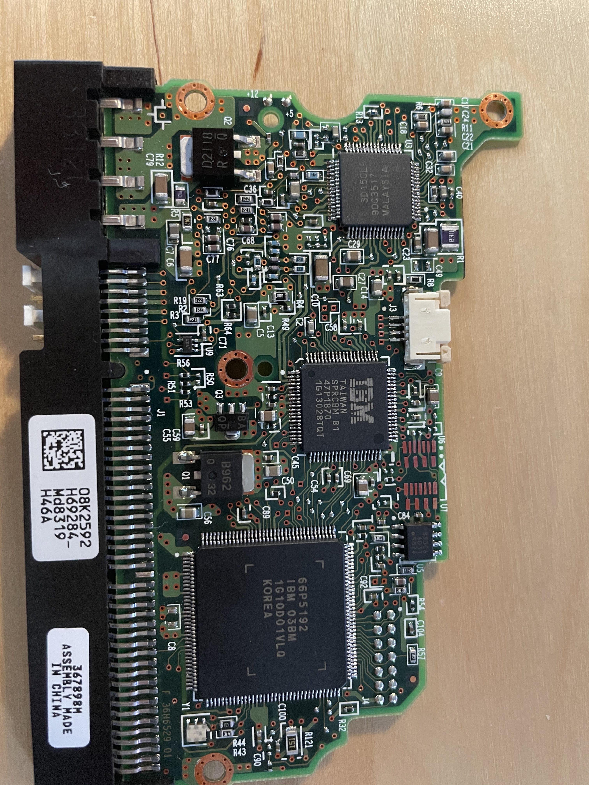
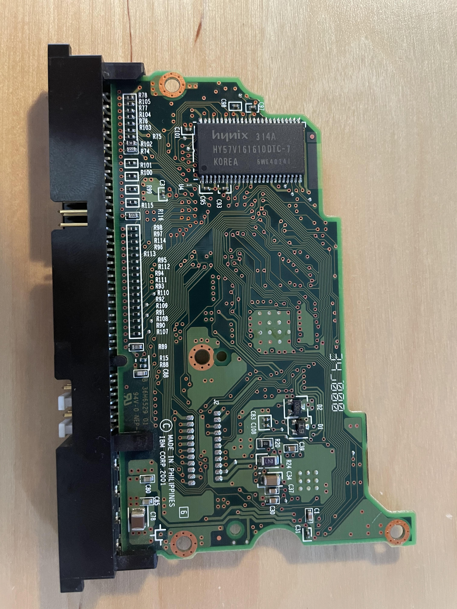
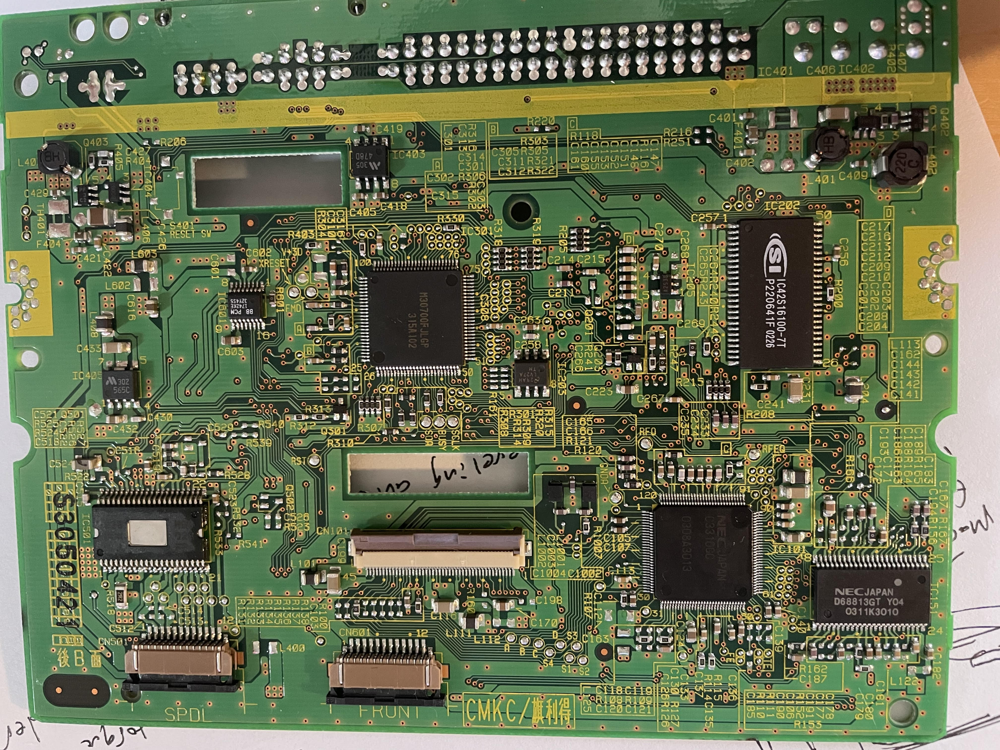
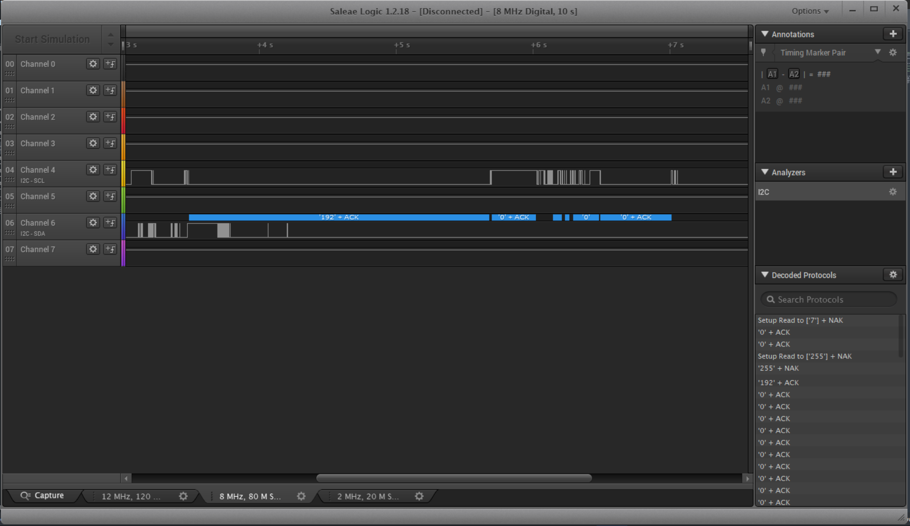

<h1> Notes on Hardware Hacking the DVD drive (Pioneer DVR-105PF) and Hard Drive (Hitachi) Both from an iMac g4 (2003)</h1> 

<h2>Hitachi Hard drive Pictures</h2>

Hitachi Front

Hitachi Back

<h2>Pioneer DVD Drive Pictures</h2>

Pioneer Front

Pioneer Back 

<h3> Attempts to get Code execution/Control of motors through the board</h3>
Both boards use a <a href="http://wfcache.advantech.com/www/embcore/pdf/SQFlash/Parallel%20ATA%20Interface%20Reference%20Design%20Guide_V0%201.pdf">PATA/IDE</a> interface to the motherboard of the iMac this is what the massive 40-pin connector is to each board. They both also recieve 12v(yellow wire) and 5v(red wire) directly from the power supply.

After extensive searching, finding specific datasheets for the boards themselves or even the individual MPUs proved unfruitful.
Here are some of the links:
<ul>
  <li><a href="https://www.scribd.com/doc/204340055/3-Pioneer">Block Diagram of a Similar Pioneer DVD drive</a> </li>
  <li><a href="https://www.pioneerelectronics.com/PUSA/Professional/Computer-Drives/DVR-105+&+DVR-A05"> Pioneer Electronics page on the DVR</a> </li>
  <li><a href="https://usermanual.wiki/Document/DVR3100SRRV2843.1505009730/view"> Detailed User Manual of Similar DVR with a MPU pinout schematic</a> </li>
  <li><a href="https://www.amazon.co.uk/IC35L060AVV207-0-08K2592-H69284_-13G0222-Hitachi/dp/B00MAN70LC">Some random info on the Hitachi</a> </li>
</ul>

Looking at the underside of the Pioneer board the immediate stand out is the i2c pads that are exposed. It seems like they are connected to the main mpu (on the front side of the board) via traces. Looking up the chip it might be an analog to digital converter -- No data sheets for this one could be found, but similar chips that share the M30XXXXX tag were labelled as analog to digital converters. Likely meaning that the other chip on the back here is some kind of decoder for the DVD input (if that process is not done by the main MPU on the front). Connecting a logic analyzer to the i2c ports the 'ACK' flag response from the peripheral device. It's a strange test pad for the i2c between these two is open seeing as there arent any other obvious test pads on the entire board...

The logic analyzer output looks like this: 

Not really sure what to do with exposed i2c pads, connecting it to a Teensy 3.5 and writing some bytes ('0' and then looped through random characters) to the line didnt really result in anything (hoping to get some of the motors to move). 

The Hitachi board has exposed test pads which is much more promising... no datasheets could be found,however, which makes it difficult to find which pins are for which pads. It does not appear to have the same layout as other common 14 pin JTAG configurations as the ground pad does not match. With a JTAG Debugger/scanner interface this could be a more fruitful avenue to get code execution on the board.

<h3> To be continued</h3>
The other obvious potential vector for attacking the boards is throught the PATA ports, looking at the pinout this may be difficult as they do not appear to connect to any programmable communication busses for the MPU. 

Finally, the other route is to directly dump and reflash the flash chip on the board- on the hitachi it is very obvious the labelled one is the flash memory. This risks bricking the device and rendering it unusable, but if there is no security measures in place then simply connecting a memory programmer to this could work. 